  

 

I build GenAI systems that work on real company data: retrieval over vector databases, text-to-SQL that lets people ask their data questions in plain language, and the pipelines and backends underneath. Senior data and AI engineer at **Experion Technologies**, based in Alappuzha, Kerala. When the builds are green, I paint.

### Running right now

- GenAI applications: RAG, embeddings and vector databases for grounded answers
- Text-to-SQL: LLMs that turn plain-language questions into correct queries
- Multi-agent AI workflows with LangGraph
- Distributed data pipelines, orchestration architectures and local-first AI tooling
- Microservices, event-driven backends and multi-tenant container orchestration
- Relational and graph data modeling, from PostgreSQL schemas to Neo4j knowledge graphs
- Writing on the blog about Python for data engineering

### Stack

### From LinkedIn

  
  

### Connect

  
  
  

